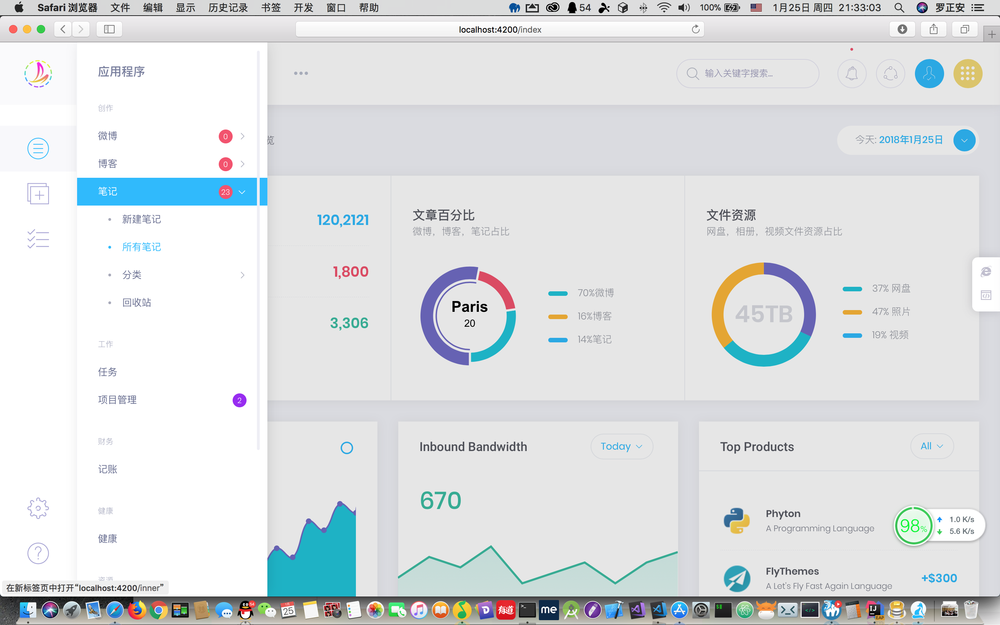

# 安浪个人工作站
安浪个人工作站：与企业员工OA系统不同，本系统完全面向个人，创建一个属于自己的完全的云端空间！

- JAVA+ActFramework+MySQL+Angular5+Metronic5+ElementUI/FreeNG

    - [AnnZone-Console](./AnnZone-Console) 管理中心，Angular5+Metronic5+各种angular第三方组件开发
    - [AnnZone-Serve](./AnnZone-Serve) WEB系统，后台接口，博客微博网页版视图，JAVA WEB开发 ActFramework框架开发

- 以API 接口为核心工作，博客和微博 会有HTML网页版，方便搞技术的搭建自己的对外博客平台，其中其它模块的数据也可以在博客站点的网页中表现...也可以做企业网站等CMS系统

- 还有Android、iOS客户端、微信小程序，客户端主要是UI设计，内容服务端轻轻松松生成
开发中...作者本人的博客系统在用，会长期更新！！！

#主要功能

1. 写博客，带有博客前台页面；
1. 记笔记，程序员的Markdown技术笔记；
1. 项目管理，把所有接手的项目记录下来；
1. 任务管理，工作台随时查看每日、每周、等任务；
1. 微博系统，个人微博，对外发布；
1. 个人网盘，把自己的文件传到服务器空间；
1. 记账系统，程序员也要学会理财咯；
1. 健康管理，定期记录自己的健康数据，程序员的健康不能忽视；
1. 相册管理，视频和相册可以收藏起来！
1. 前期没有那么精力实现所有构想的功能，会逐步迭代维护，尽快速度升级！

**开发过程中：**
