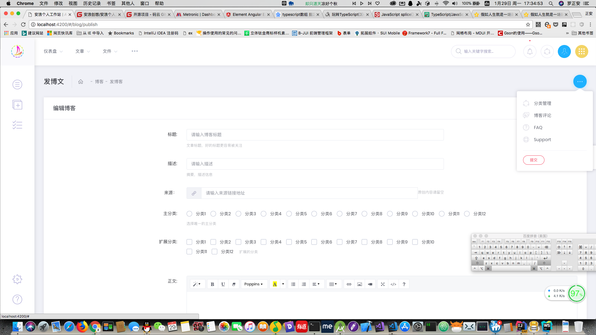
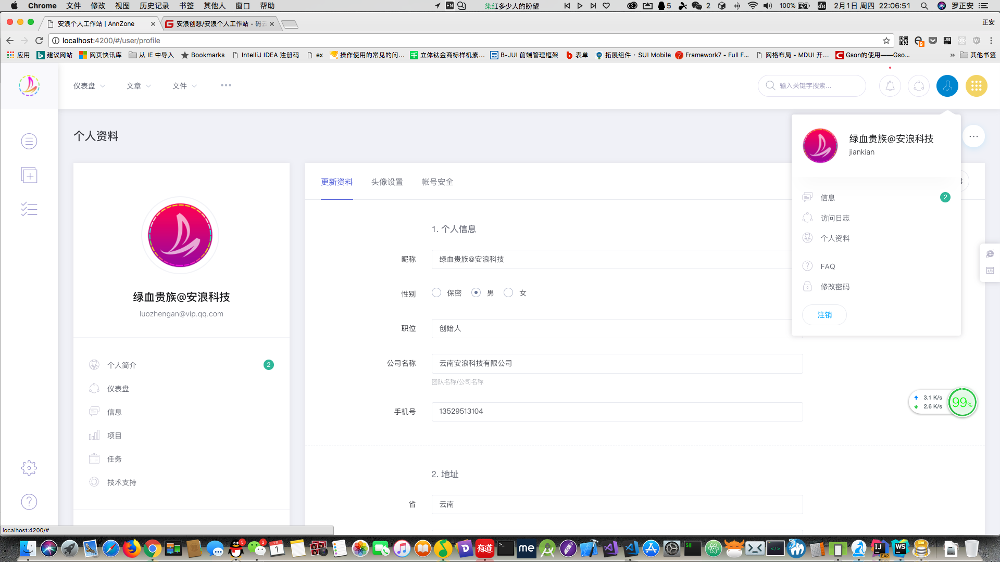

# 安浪个人工作站
安浪个人工作站：与企业员工OA系统不同，本系统完全面向个人，创建一个属于自己的完全的云端空间！

- JAVA+[ActFramework](http://www.ActFramework.org)+MySQL+[Angular5](http://angular.io)+Metronic5+[Ant Design for Angular](https://ng.ant.design/) (NG-ZORRO-ANTD)

    - [AnnZone-Console](./AnnZone-Console) 管理中心，Angular5+Metronic5+各种Angular5第三方组件开发 ng-zorro-antd (Ant Design for angular)
    - [AnnZone-Serve](./AnnZone-Serve) WEB系统，后台接口，博客微博网页版视图，JAVA WEB开发 ActFramework框架`1.6.6+`开发
    - [AnnZone-Android](./AnnZone-Android) 安卓Android APP客户端版本 Kotlin语言`1.2.10+`开发
    - [AnnZone-iOS](./AnnZone-iOS) 苹果iOS APP客户端版本 Swift `4.0.3` + Xcode `9.2`开发
    - [AnnZone-MiniProgram](./AnnZone-MiniProgram) 微信小程序 `1.9.5`最新版本组件化开发
    - [素材和资源](./素材和资源) 项目用到的设计图、资源、素材等文件。Angular后台素材、Android/iOS APP素材、网页版素材、微信小程序素材等

- 以API 接口为核心工作，博客和微博 会有HTML网页版，方便搞技术的搭建自己的对外博客平台，其中其它模块的数据也可以在博客站点的网页中表现...也可以做企业网站等CMS系统

- 还有Android、iOS客户端、微信小程序，客户端主要是UI设计，内容服务端轻轻松松生成
开发中...作者本人的博客系统在用，会长期更新！！！

- 2018年不去泡妹子不去吃鸡不去喝酒，所有空闲时间都会跟进本项目！！！！！作为研究、学习、使用、分享

# 主要功能
1. 写博客，带有博客前台页面；
1. 记笔记，程序员的Markdown技术笔记；
1. 项目管理，把所有接手的项目记录下来；
1. 任务管理，工作台随时查看每日、每周、等任务；
1. 微博系统，个人微博，对外发布；
1. 个人网盘，把自己的文件传到服务器空间；
1. 记账系统，程序员也要学会理财咯；
1. 健康管理，定期记录自己的健康数据，程序员的健康不能忽视；
1. 相册管理，视频和相册可以收藏起来！
1. 前期没有那么精力实现所有构想的功能，会逐步迭代维护，尽快速度升级！

**开发过程中：**

**文档问题**

现在还初步阶段，完善到完整博客系统会发布搭建博客平台的视频教程，完成安卓端后会发安卓打包成自己APP（可做独立博客APP提高逼格发布应用市场，可以做企业新闻APP，信息展示APP等）。

文档存在于各个项目的目录下的README.md文件中，代码里面没去掉各种控制台打印调试，注释也不少，会相应技术的人都应该看得懂。
需要掌握的有：angular相关知识，java MVC框架 ActFramework 。
需要手把手只用而不去自己去完成开发的用户，请等我完善后发视频链接！

**Copyright**

MIT开源，想怎么改，怎么用，怎么卖，怎么骂都随意，（注意引用的第三方库的版权）
